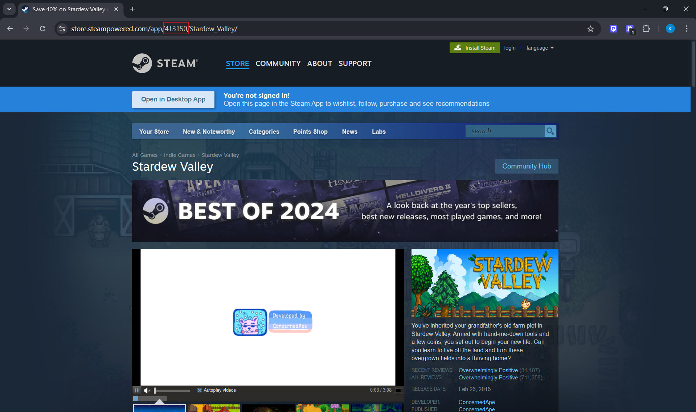

# steam scrapy

## Description

This project is a web scraper that collects data from the Stream store. You can use the app id to get the information
you
want, such as the name of the game, the price, the discounted price, reviews, etc.

About the app id, you can get it from the URL of the game. For example,https://store.steampowered.com/app/413150/Stardew_Valley/ is the URL of Stardew Valley, and the app id is `413150`. You should collect the app id for those game you want to
scrape.


## Spiders

### app_info
get the information of the game, such as the name,original price, discounted price, developer, publisher, release date, etc.

### review
get the reviews of the game, such as the review title, content, date etc.


## Usage

Install the required packages
```shell
pip install -r requirements.txt
```
This project is based on the Scrapy framework, you can run the spider by the command `scrapy crawl [options] <spider>`.

But I recommend you to read,edit and run the main.py. I use `cmdline.excute` function to run the command. I use the `-a` option 
to pass the argument I defined in the spider and the `-O` option to define the output file path.

Run the main.py file
```shell
python main.py
```

after running the main.py, you will get the output file `app_info_output.json` for app_info spider. And the output file 
`review_output.json` for review spider. It would be changed if you edit the `main.py` file.